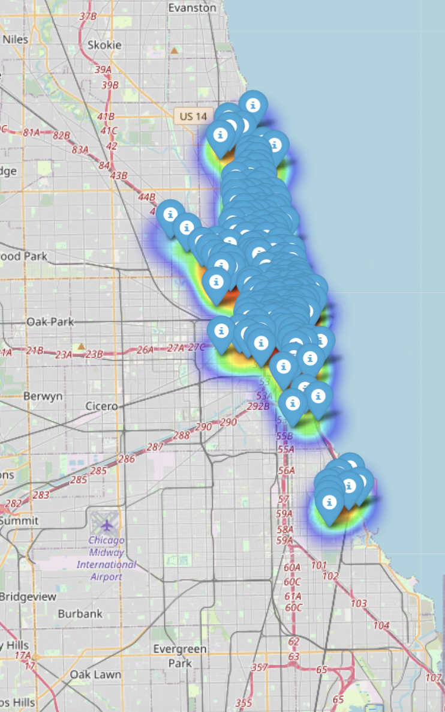
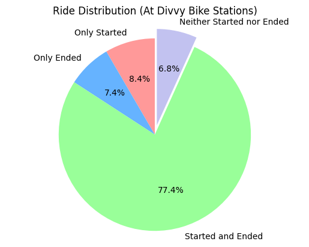
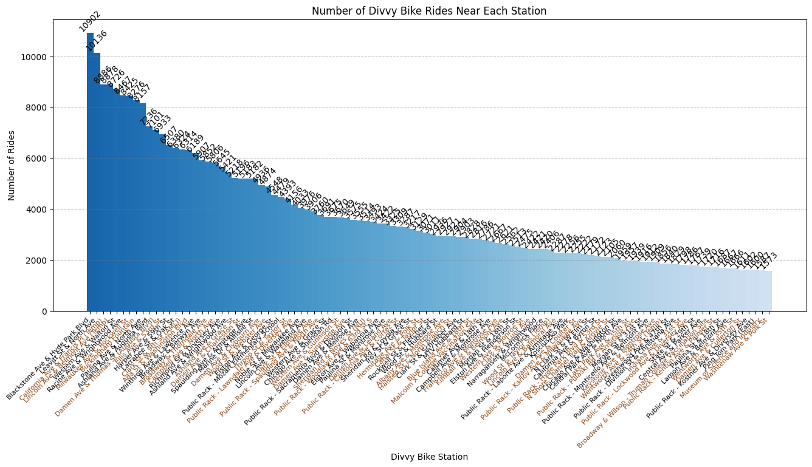
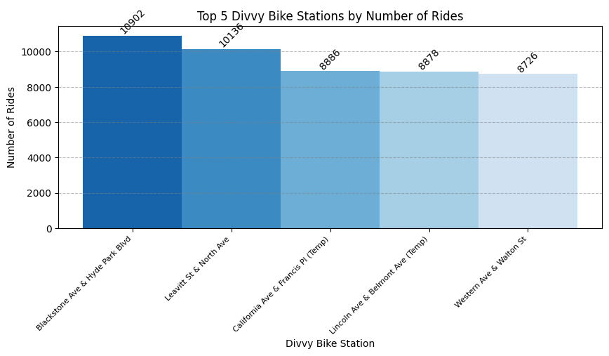
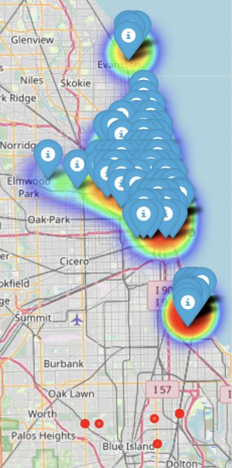
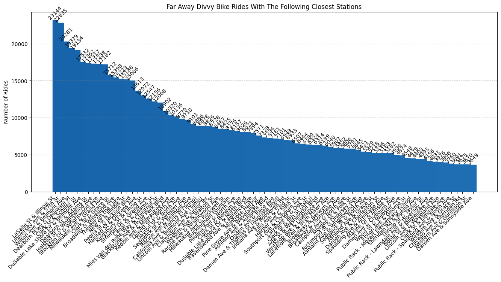
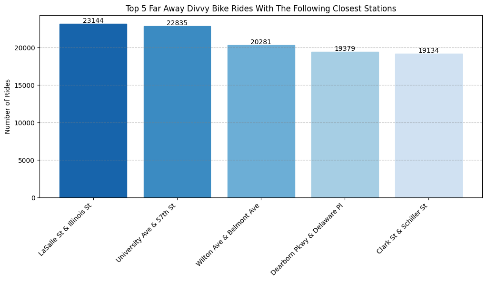
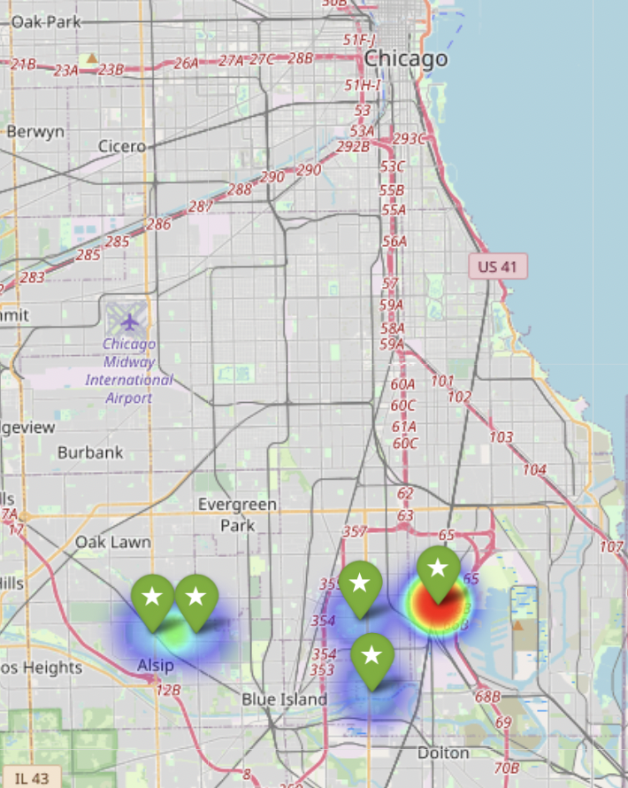

# DivvyBikeIdealPlacement
This repository analyzes Divvy Bike data where there would be high rides and lower bike rack density areas for recommendations for new locations of bikes and stations. I have added a link to the data I have used throughout this project.

###Data Analysis and Findings: Divvy Bike Station Placement

This project analyzes Divvy bike ride data and the locations of Divvy bike stations. The objective is to understand ride patterns and identify potential locations for new bike stations. Let's break down the analysis and findings step-by-step:

##Step 1: Data Preprocessing and Filtering
The first part of the code is responsible for reading the Divvy bike stations data and the combined bike ride data. It then filters the rides that don't start or end at Divvy bike stations and drops rows with missing or invalid coordinates. It calculates the distance of each ride's starting point from the nearest bike station using a HashMap with station coordinates and names.

Next, it combines all the filtered data into a single DataFrame and selects the required columns (start and end coordinates, nearest station name, and distance to the nearest station). The filtered data is then saved to a new file.

##Step 2: Binning the Data
The second part of the code involves binning the data based on the nearest station distance. It calculates the bin intervals and fills up the bins with indices of values falling within each interval. It also defines a function to find the nearest neighbors to a specified value. The code calculates the nearest and farthest Divvy bike station distances and their corresponding stations for the top 200 stations with the highest ride counts.

We can then visualize the top 200 most used Divvy stations on the following Folium map. You may interact with the map by running the HTML on the [divvy_map.html file]([https://drive.google.com/drive/u/2/folders/1w776iEfUUf3QOh8_fNpGKimubyaOjSRR](https://drive.google.com/drive/u/2/folders/1w776iEfUUf3QOh8_fNpGKimubyaOjSRR)) in my [Google Drive folder](https://drive.google.com/drive/u/2/folders/1w776iEfUUf3QOh8_fNpGKimubyaOjSRR) but here is a snapshot.

##Step 3: Analyzing Ride Distribution at Divvy Bike Stations
The code creates a pie chart to visualize the distribution of rides at Divvy bike stations. It calculates the percentage of rides that only started at a station, only ended at a station, both started and ended at a station, and neither started nor ended at a station. Further analysis will focus on the 6.8% of rides that neither started nor ended at a Divvy Bike station but were rather found on a random street and left at another random location.

##Step 4: Visualizing Ride Counts at Top Divvy Bike Stations
Next I generate a bar chart to visualize the number of rides near each top Divvy bike station. The top 200 stations with the highest ride counts are selected and plotted on the bar chart. Stations are grouped into subsets, and each subset is represented with a different color on the chart.

You can visualize these stations on the map below. The green dots are all the stations and the red-orange dots represent locations with the farthest rides that have taken place. You may interact with the map [here:]([[https://drive.google.com/drive/u/2/folders/1w776iEfUUf3QOh8_fNpGKimubyaOjSRR](https://drive.google.com/drive/u/2/folders/1w776iEfUUf3QOh8_fNpGKimubyaOjSRR](https://drive.google.com/drive/u/2/folders/1w776iEfUUf3QOh8_fNpGKimubyaOjSRR))) in my [Google Drive folder](https://drive.google.com/drive/u/2/folders/1w776iEfUUf3QOh8_fNpGKimubyaOjSRR) but here is a snapshot.

Presented here are the top 5 stations. To optimize user experience, I would recommend expanding the bike slots at these stations, as insufficient docking space might be leading to users leaving bikes unattended. Additionally, these areas exhibit a promising potential for increased demand, considering that Divvy bikes themselves serve as effective advertising tools with their prominently displayed logo. As a result, individuals seeking swift and convenient transportation solutions may turn to Divvy Bikes.

##Step 5: Identifying Farthest Divvy Bike Ride Locations
I then identify the farthest Divvy bike ride locations and their nearest station distances. This heatmap visualizes the density of farthest ride locations and adds markers for the top 200 stations with the highest count. You may interact with the map [here:]([[[https://drive.google.com/drive/u/2/folders/1w776iEfUUf3QOh8_fNpGKimubyaOjSRR](https://drive.google.com/drive/u/2/folders/1w776iEfUUf3QOh8_fNpGKimubyaOjSRR](https://drive.google.com/drive/u/2/folders/1w776iEfUUf3QOh8_fNpGKimubyaOjSRR))](https://drive.google.com/drive/u/2/folders/1w776iEfUUf3QOh8_fNpGKimubyaOjSRR)) 

Here are 77 prominent Divvy bike station locations nearest to faraway bike rides, with each station being the closest option for those respective journeys.

Here are the top 5 of those stations:

##Step 6: Finding Potential Locations for New Stations
The code uses K-means clustering to identify potential locations for new bike stations based on the farthest ride locations. It clusters the farthest locations into five groups and adds markers for these potential station locations on the heatmap.The visualization is depicted below and you may interact with the map [here:]([https://drive.google.com/drive/u/2/folders/1w776iEfUUf3QOh8_fNpGKimubyaOjSRR](https://drive.google.com/drive/u/2/folders/1w776iEfUUf3QOh8_fNpGKimubyaOjSRR)) 

###Conclusion:
In this project, we have performed a comprehensive analysis of Divvy bike data to identify high-usage ride areas and areas with lower bike rack density, with the aim of recommending new bike station locations. The project's significance lies in its potential to optimize bike station placement, enhancing user convenience and promoting sustainable transportation options.

The top 5 stations identified in the analysis have demonstrated promising potential for expansion, indicating a need for additional bike slots to accommodate the rising demand. 

The recommended new stations are located primarily in southwest neighborhoods of Chicago, indicating a need for better transit accessibility. With expansion efforts, it may be beneficial to also advertise the [Divvy for Everyone program]((https://divvybikes.com/pricing/d4e)) , which provides a one-time Annual Membership for $5 for qualifying residents. I believe this program would help attract new customers and increase expansion, which would especially be beneficial in areas that have less Chicago Transit Authority coverage.  

In conclusion, this project's findings offer valuable insights for the expansion and improvement of Divvy bike stations, catering to users' needs, reducing congestion, and contributing to a greener and more sustainable urban environment. The provided data and visualizations are accessible through the linked files and maps, allowing stakeholders to explore and make data-driven decisions for the future development of Divvy bike systems. Overall, this project was insightful for me to understand Chicago Divvy bike ridership behavior and understand where there may be need for more bikes. 
